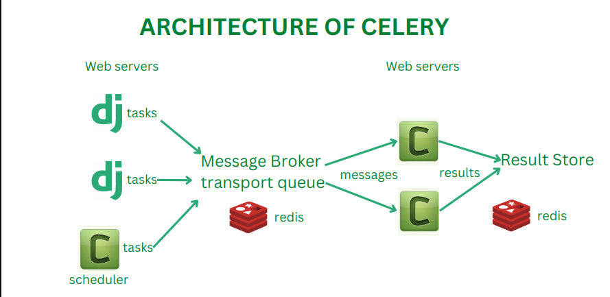
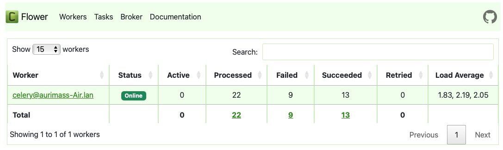
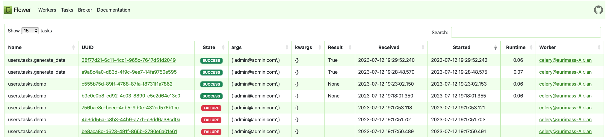

# intellify-test

This is Colibrix test task the API to create the with small user and projects functionality.

## Requirements

This project uses [PostgreSQL](https://www.postgresql.org/), so, in order to make it working, install in your local machine or use Docker.


## Development

After cloning this project, do this steps.

Create .env file and put your project credentials
```
DATABASE_NAME = <database-name>
DATABASE_USER = <database-user>
DATABASE_PASSWORD = <database-password>
DATABASE_HOST =<host>
DATABASE_PORT = <database_port></database_port>

SECRET_KEY = <secret_key>
```
if lost or dont remember django secret key can generate new,used this function:

```
from django.core.management.utils import get_random_secret_key
```

Create virtual environment and activated:
```
pip install virtualenv 
python -m venv <name_venv>
source <name_venv>/bin/activate
```
Install dependencies:
```
pip install -r requirements.txt
```
Make in project migrations:
```
python manage.py makemigrations && python manage.py migrate 
```
Load test data in project:
```
python manage.py loaddata db.json   
```
Create superuser:
```
python manage.py createsuperuser
```

or use this:
```
email: admin@admin.com
password: admin
```
Run django local server:
```
python manage.py runserver
```


We will use the Swagger API to test our endpoints more easily!

- `http://127.0.0.1:8000/api/` - Endpoints
- `http://127.0.0.1:8000/admin/` - Admin panel


## MQTT

For MQTT broker we using celery and redis.



First run celery worker:
```
celery -A core worker -l info
```
Now can try using this endpoint `http://127.0.0.1:8000/users/gen-data/` , generate timeseries data.You can see logs about task/messages. 


Then project grow, we add/create many tasks in broker message queue,we want know:

- How much tasks succeeded/processed/failed
- Whats task failed
- Task runtime



To monitoring message broker we used Flower.
Run flower dashboard with this command:
```
celery -A core flower --port=5555  
```
Now can check monitoring dashboard on this url `http://127.0.0.1:5555`

Remember django and celery worker must be run
